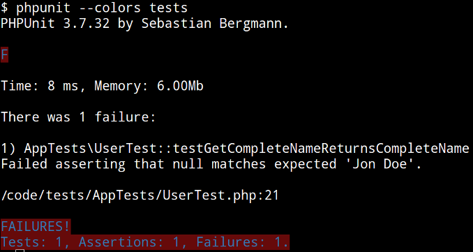

TDD - Desenvolvimento guiado por testes
--------------------------------------------------------------------------------

O que é?

Por quê?

1. Testes te ajudam a criar o design da API da sua classe
2. Testes te ajudam a criar o design da arquitetura do seu sistema
3. Testes te ajudam a implementar os membros da sua classe
4. Com testes, você tem certeza de que sua aplicação ainda vai funcionar corretamente depois que você mudá-la
5. Testes documentam a sua API
6. Testes documentam o seu sistema

Red Green Refactor
--------------------------------------------------------------------------------


PHPUnit
--------------------------------------------------------------------------------

# TDD

- Test Driven Development
- Test First
- Red - Green Refactoring

Gimme some Code!
-------------------------------------------------------------------------------

Crie sua classe.

```php
<?php
// lib/App/User.php

namespace App;

class User
{
    public function __construct($name, $lastName)
    {
    }
}
```
Crie sua classe de testes

```php

<?php

// tests/AppTests/UserTest.php

namespace AppTests;

use App\User;

class UserTest extends \PHPUnit_Framework_TestCase
{
    public function testGetCompleteNameReturnsCompleteName()
    {
        // Setup
        $user = new User("Jon", "Doe");

        // Exercise
        $completeName = $user->getCompleteName();

        // Verify
        $this->assertEquals("Jon Doe", $completeName);
    }
}
```

Rode o teste. Ele deve falhar.

    $ phpunit tests

    PHP Fatal error:  Class 'App\User' not found in /codepath/tests/AppTests/UserTest.php on line 12
    PHP Stack trace:
    PHP   1. {main}() /usr/local/bin/phpunit.phar:0
    PHP Fatal error:  Class 'App\User' not found in /codepath/code/tests/AppTests/UserTest.php on line 12
    PHP Stack trace:
    [...]

Oops, precisamos fazer o require da classe (ou melhor, use algum autoloader, do composer de preferência). Vamos de require por enquanto

```php
<?php
// tests/AppTest/UserTest.php
//
namespace AppTests;

use App\User;

require_once dirname(__FILE__) . "/../../lib/App/User.php";
// [...]
```

Rode o teste novamente

    phpunit tests

    PHPUnit 3.7.32 by Sebastian Bergmann.

    PHP Fatal error:  Call to undefined method App\User::getCompleteName() in /codepath/tests/AppTests/UserTest.php on line 17
    PHP Stack trace:
    [...]

Hum... esquecemos de criar o método. Crie.


```php
<?php

// lib/App/User.php

namespace App;

class User
{
    public function __construct($name, $lastName)
    {
    }

    public function getCompleteName()
    {
    }
}
```

Rode o teste



Yay! Este é o erro que queriamos ver. Note o "F" no resultado. E note o erro.

Agora nós só precisamos implementar o método de maneira que o teste passe!

```php
<?php

// lib/App/User.php

namespace App;

class User
{
    private $name;
    private $lastName;

    public function __construct($name, $lastName)
    {
        $this->name     = $name;
        $this->lastName = $lastName;
    }

    public function getCompleteName()
    {
        return implode(" ", array(
            $this->name,
            $this->lastName,
        ));
    }
}
```


Yay! Agora nosso teste passou. Refatore, rode os testes.

Talvez o seu código melhore, fique mais simples...

```php
<?php

// lib/App/User.php

namespace App;

class User
{
    private $name;
    private $lastName;

    public function __construct($name, $lastName)
    {
        $this->name     = $name;
        $this->lastName = $lastName;
    }

    public function getCompleteName()
    {
        return $this->name . " " . $this->lastName;
    }
}
```

Ou não...

```php

<?php

// lib/App/User.php

namespace App;

class User
{
    private $name;
    private $lastName;

    public function __construct($name, $lastName)
    {
        $this->name     = $name;
        $this->lastName = $lastName;
    }

    public function getCompleteName()
    {
        ob_start();
        echo $this->name;
        echo " ";
        echo $this->lastName;
        return ob_get_clean();
    }
}
```

Mas o importante é que ele vai continuar funcionando...


